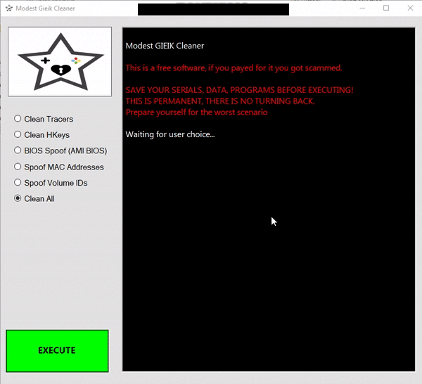

# Modest GIEIK Cleaner
**OUTDATED** Permanent Win X64 Cleaner/Spoofer.

## Features
1. Clean Tracers. (probably some path has changed.)
2. Clean HKeys.
3. Spoof BIOS (AMI Bios supported).
4. Spoof MAC Address.
5. Spoof Volume IDs.
6. Clean all - Do all the tasks above.

### Usage
Get ready for the worst scenario, explode your PC.
Make a backup of everything that is important.
Make a backup of window registry and take note of your hardware serials.
This is **permanent stuff**, there is **no turning back once you execute it**.

You should shut down every app before using the cleaner.
Most changes will be showing up only after reboot.
Use it at your own risk.

This project has been archived and no future support will be given.
All responsibility belongs to the user.
This project is shared with the community for Educational Purposes only.

